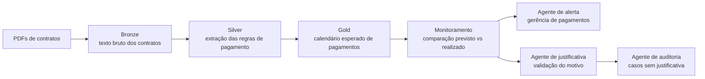

# Contract Payment Calendar with AI Monitoring

## PT-BR

Projeto de portfólio que simula um cenário real de leitura de contratos em PDF com formatos diferentes, extração de cláusulas de pagamento, construção de calendário financeiro e uso de agentes de IA para alertas gerenciais e escalonamento para auditoria.

O caso foi estruturado para reproduzir um fluxo semelhante ao que seria implementado em uma arquitetura com `Databricks`, usando uma organização em camadas `bronze / silver / gold` e uma camada de agentes inspirada em `CrewAI`.

## O que o projeto faz

- gera contratos em PDF com layouts e cláusulas de pagamento diferentes
- lê os PDFs e extrai o texto contratual
- identifica regras como:
  - pagamento mensal em dia fixo
  - pagamento no `n`-ésimo dia útil
  - pagamento trimestral
  - parcela única após aceite
- monta um calendário esperado de pagamentos
- compara o calendário esperado com um log de pagamentos realizados
- cria alertas para a gerência quando há divergência
- encaminha para auditoria interna os casos sem justificativa

## Arquitetura do pipeline



## Stack técnico

- `reportlab`
  Para gerar PDFs de demonstração com formatos diferentes.
- `pypdf`
  Para leitura e extração de texto dos contratos.
- `pandas`
  Para tratamento tabular e consolidação do calendário.
- `python-dateutil`
  Para regras de datas e recorrência.
- `streamlit`
  Para visualização do pipeline.
- `plotly`
  Para gráficos no dashboard.
- `CrewAI`
  Referenciado na camada de agentes; o projeto usa fallback determinístico para rodar sem depender de credenciais de LLM durante a demo. Para a experiência completa com CrewAI, recomenda-se `Python 3.11` ou `3.12` com instalação via `requirements-agents.txt`.

## Técnicas usadas

- `PDF generation`
  Os contratos de exemplo são gerados programaticamente para simular layouts heterogêneos e cláusulas financeiras em linguagem natural.
- `PDF text extraction`
  O texto bruto é extraído com `pypdf` e armazenado na camada `bronze`.
- `Rule-based information extraction`
  A identificação de vencimento, periodicidade, aceite e valor é feita com `regex` e regras de negócio explícitas.
- `Schedule normalization`
  As cláusulas textuais são transformadas em uma estrutura padronizada de pagamento na camada `silver`.
- `Calendar generation`
  As regras são convertidas em ocorrências concretas de pagamentos esperados na camada `gold`.
- `Expected vs actual reconciliation`
  O pipeline compara o calendário previsto com pagamentos efetivamente realizados e calcula desvios de data e valor.
- `Agent-based escalation`
  A camada de agentes decide se um caso vira apenas alerta gerencial ou escalonamento para auditoria.

## Como funciona o sistema de agentes

O projeto foi desenhado para comportar três papéis de agentes:

1. `Payment Monitoring Agent`
   Lê o monitoramento previsto vs realizado e identifica pagamentos com atraso, ausência ou divergência de valor.
2. `Justification Review Agent`
   Analisa se existe justificativa operacional registrada e se a ocorrência ainda exige ação corretiva.
3. `Internal Audit Agent`
   Recebe apenas os casos sem justificativa suficiente e cria a fila de revisão para auditoria interna.

Na implementação atual, a função [run_payment_agents](./src/agents.py) executa um `fallback determinístico`, o que garante que a demo rode de ponta a ponta sem credenciais externas. Isso foi uma decisão intencional para manter o projeto reproduzível no GitHub e no ambiente local.

## Configuração da camada de agentes

Hoje o projeto está preparado em dois níveis:

- `requirements.txt`
  Dependências principais para o pipeline de contratos, calendário, monitoramento e dashboard.
- `requirements-agents.txt`
  Dependência opcional de `CrewAI`, voltada para um ambiente compatível com `Python 3.11` ou `3.12`.

Quando a stack de agentes é habilitada, a ideia é configurar:
- um `LLM` para raciocínio sobre justificativas e priorização
- `Agents` com papéis distintos
- `Tasks` separadas para alerta, validação e auditoria
- uma `Crew` para orquestrar o fluxo de decisão

## Papel do LLM neste projeto

O `LLM` não é responsável por extrair datas contratuais “no escuro” nem por substituir as regras financeiras. O papel mais adequado dele aqui é:

- interpretar justificativas textuais de pagamento
- resumir ocorrências para a gerência
- classificar risco de desvio com base no contexto operacional
- redigir o racional de encaminhamento para auditoria

Ou seja, o `LLM` atua como uma camada de interpretação e explicação, não como o núcleo transacional do sistema.

## É fine-tuning?

Não. Este projeto **não usa fine-tuning**.

O desenho atual é baseado em:
- extração estruturada com `regex` e regras determinísticas
- comparação de datas e valores com lógica de negócio
- orquestração de agentes para decisão e escalonamento
- uso opcional de `CrewAI` com um `LLM` generalista para raciocínio textual

Se esse sistema fosse evoluído para produção, faria mais sentido:
- usar `prompt engineering`
- adicionar `few-shot examples`
- manter trilhas de auditoria das decisões
- e só considerar fine-tuning se houvesse um volume grande de justificativas históricas rotuladas

## Regras de negócio e IA utilizadas

As principais regras e heurísticas do projeto são:

- pagamentos mensais em dia fixo
- pagamentos mensais no `n`-ésimo dia útil
- pagamentos trimestrais em meses específicos
- parcela única após aceite formal
- comparação entre `expected_payment_date` e `actual_payment_date`
- classificação em:
  - `on_time`
  - `paid_late`
  - `paid_early`
  - `missing_payment`
  - `amount_mismatch`
- escalonamento para auditoria apenas quando existe desvio relevante sem justificativa

Esse desenho combina:
- `rule-based AI`
- `deterministic decisioning`
- `agent orchestration`
- e `human-in-the-loop ready escalation`

## Estrutura

- [main.py](./main.py): execução ponta a ponta do pipeline
- [app.py](./app.py): dashboard em Streamlit
- [scripts/generate_demo_assets.py](./scripts/generate_demo_assets.py): geração dos PDFs e dos pagamentos de exemplo
- [src/pdf_generation.py](./src/pdf_generation.py): geração dos contratos PDF
- [src/contract_extraction.py](./src/contract_extraction.py): leitura e extração das cláusulas
- [src/payment_calendar.py](./src/payment_calendar.py): construção do calendário esperado
- [src/monitoring.py](./src/monitoring.py): monitoramento do previsto vs realizado
- [src/agents.py](./src/agents.py): camada de agentes / fallback determinístico
- [tests/test_pipeline.py](./tests/test_pipeline.py): teste automatizado

## Como executar

```bash
python3 -m venv .venv
source .venv/bin/activate
pip install -r requirements.txt
python3 main.py
streamlit run app.py
```

Para habilitar a dependência opcional de agentes em ambiente compatível:

```bash
pip install -r requirements-agents.txt
```

## Resultado esperado da demo

- contratos com cláusulas extraídas corretamente
- calendário financeiro consolidado
- alertas de pagamentos fora da data
- casos encaminhados para auditoria quando não houver justificativa

## EN

Portfolio project that simulates a real-world scenario where multiple contract PDFs with different formats are ingested, payment clauses are extracted, a financial calendar is created, and AI agents are used for payment monitoring and audit escalation.

The case was structured to resemble a `Databricks-style` pipeline with `bronze / silver / gold` layers and an agent layer inspired by `CrewAI`.

## What the project does

- generates demo contract PDFs with different payment clause patterns
- reads the PDFs and extracts raw contractual text
- identifies payment rules such as:
  - monthly fixed-day payment
  - nth business day payment
  - quarterly payment
  - one-time payment after acceptance
- builds an expected payment calendar
- compares the expected schedule against actual payment logs
- creates alerts for the payment management team
- escalates unjustified deviations to internal audit

## Technical stack

- `reportlab`
  Generates demo PDFs with different layouts.
- `pypdf`
  Reads and extracts text from the contracts.
- `pandas`
  Handles tabular transformation and calendar consolidation.
- `python-dateutil`
  Supports recurrence and date calculations.
- `streamlit`
  Provides the visual dashboard.
- `plotly`
  Renders charts.
- `CrewAI`
  Referenced in the agent layer; the project uses a deterministic fallback so the demo runs without LLM credentials. For full CrewAI execution, use `Python 3.11` or `3.12` and install `requirements-agents.txt`.

## Techniques used

- `PDF generation`
  Demo contracts are programmatically generated to simulate heterogeneous layouts and financial clauses written in natural language.
- `PDF text extraction`
  Raw contract text is extracted with `pypdf` and stored in the `bronze` layer.
- `Rule-based information extraction`
  Due dates, recurrence logic, acceptance events, and payment amounts are identified with `regex` and explicit business rules.
- `Schedule normalization`
  Textual clauses are transformed into a normalized payment-rule table in the `silver` layer.
- `Calendar generation`
  Contract rules are converted into concrete expected payment events in the `gold` layer.
- `Expected vs actual reconciliation`
  The pipeline compares scheduled payments with actual execution logs and measures date/value deviations.
- `Agent-based escalation`
  The agent layer decides whether a case becomes a management alert or an internal audit escalation.

## How the agent system works

The project is structured around three agent roles:

1. `Payment Monitoring Agent`
   Reads the expected-vs-actual monitoring output and identifies late, missing, or mismatched payments.
2. `Justification Review Agent`
   Reviews whether an operational justification exists and whether the case still needs escalation.
3. `Internal Audit Agent`
   Receives only the unresolved or unjustified deviations and prepares them for internal audit review.

In the current implementation, [run_payment_agents](./src/agents.py) executes a `deterministic fallback`, ensuring the full demo runs without external credentials. This was an intentional design choice to keep the repository reproducible in GitHub and local environments.

## Agent layer configuration

The project is prepared in two layers:

- `requirements.txt`
  Core dependencies for contract ingestion, calendar generation, monitoring, and dashboarding.
- `requirements-agents.txt`
  Optional `CrewAI` dependency for environments compatible with `Python 3.11` or `3.12`.

When the agent stack is enabled, the intended setup is:
- one `LLM` for reasoning over justifications and prioritization
- multiple `Agents` with specialized roles
- separated `Tasks` for alerting, reviewing, and auditing
- a `Crew` orchestrating the end-to-end decision flow

## Role of the LLM in this project

The `LLM` is not meant to blindly extract contractual due dates or replace hard financial logic. Its most appropriate role here is to:

- interpret textual payment justifications
- summarize exceptions for management
- assess risk signals from operational context
- draft the explanation used when escalating a case to audit

So the `LLM` acts as an interpretation and explanation layer, not as the transactional core of the system.

## Is this a fine-tuned model?

No. This project **does not use fine-tuning**.

The current design is based on:
- structured extraction with `regex` and deterministic business rules
- date and amount reconciliation logic
- agent orchestration for routing and escalation
- optional use of `CrewAI` with a general-purpose `LLM` for text reasoning

If this system were evolved into production, a more realistic path would be:
- `prompt engineering`
- `few-shot examples`
- auditable decision traces
- and only later considering fine-tuning if a large labeled history of payment justifications existed

## Business rules and AI logic used

The main business rules and heuristics in the project are:

- monthly payments on a fixed day
- monthly payments on the `n`th business day
- quarterly payments on specific months
- one-time payment after formal acceptance
- comparison between `expected_payment_date` and `actual_payment_date`
- status classification into:
  - `on_time`
  - `paid_late`
  - `paid_early`
  - `missing_payment`
  - `amount_mismatch`
- escalation to audit only when a relevant deviation has no sufficient justification

This design combines:
- `rule-based AI`
- `deterministic decisioning`
- `agent orchestration`
- and `human-in-the-loop ready escalation`
