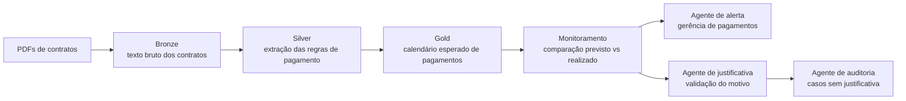

# Contract Payment Calendar with AI Monitoring

## PT-BR

Projeto de portfólio que simula um cenário real de leitura de contratos em PDF com formatos diferentes, extração de cláusulas de pagamento, construção de calendário financeiro e uso de agentes de IA para alertas gerenciais e escalonamento para auditoria.

O caso foi estruturado para reproduzir um fluxo semelhante ao que seria implementado em uma arquitetura com `Databricks`, usando uma organização em camadas `bronze / silver / gold` e uma camada de agentes inspirada em `CrewAI`.

## O que o projeto faz

- gera contratos em PDF com layouts e cláusulas de pagamento diferentes
- lê os PDFs e extrai o texto contratual
- identifica regras como:
  - pagamento mensal em dia fixo
  - pagamento no `n`-ésimo dia útil
  - pagamento trimestral
  - parcela única após aceite
- monta um calendário esperado de pagamentos
- compara o calendário esperado com um log de pagamentos realizados
- cria alertas para a gerência quando há divergência
- encaminha para auditoria interna os casos sem justificativa

## Arquitetura do pipeline



## Stack técnico

- `reportlab`
  Para gerar PDFs de demonstração com formatos diferentes.
- `pypdf`
  Para leitura e extração de texto dos contratos.
- `pandas`
  Para tratamento tabular e consolidação do calendário.
- `python-dateutil`
  Para regras de datas e recorrência.
- `streamlit`
  Para visualização do pipeline.
- `plotly`
  Para gráficos no dashboard.
- `CrewAI`
  Referenciado na camada de agentes; o projeto usa fallback determinístico para rodar sem depender de credenciais de LLM durante a demo. Para a experiência completa com CrewAI, recomenda-se `Python 3.11` ou `3.12` com instalação via `requirements-agents.txt`.

## Estrutura

- [main.py](./main.py): execução ponta a ponta do pipeline
- [app.py](./app.py): dashboard em Streamlit
- [scripts/generate_demo_assets.py](./scripts/generate_demo_assets.py): geração dos PDFs e dos pagamentos de exemplo
- [src/pdf_generation.py](./src/pdf_generation.py): geração dos contratos PDF
- [src/contract_extraction.py](./src/contract_extraction.py): leitura e extração das cláusulas
- [src/payment_calendar.py](./src/payment_calendar.py): construção do calendário esperado
- [src/monitoring.py](./src/monitoring.py): monitoramento do previsto vs realizado
- [src/agents.py](./src/agents.py): camada de agentes / fallback determinístico
- [tests/test_pipeline.py](./tests/test_pipeline.py): teste automatizado

## Como executar

```bash
python3 -m venv .venv
source .venv/bin/activate
pip install -r requirements.txt
python3 main.py
streamlit run app.py
```

Para habilitar a dependência opcional de agentes em ambiente compatível:

```bash
pip install -r requirements-agents.txt
```

## Resultado esperado da demo

- contratos com cláusulas extraídas corretamente
- calendário financeiro consolidado
- alertas de pagamentos fora da data
- casos encaminhados para auditoria quando não houver justificativa

## EN

Portfolio project that simulates a real-world scenario where multiple contract PDFs with different formats are ingested, payment clauses are extracted, a financial calendar is created, and AI agents are used for payment monitoring and audit escalation.

The case was structured to resemble a `Databricks-style` pipeline with `bronze / silver / gold` layers and an agent layer inspired by `CrewAI`.

## What the project does

- generates demo contract PDFs with different payment clause patterns
- reads the PDFs and extracts raw contractual text
- identifies payment rules such as:
  - monthly fixed-day payment
  - nth business day payment
  - quarterly payment
  - one-time payment after acceptance
- builds an expected payment calendar
- compares the expected schedule against actual payment logs
- creates alerts for the payment management team
- escalates unjustified deviations to internal audit

## Technical stack

- `reportlab`
  Generates demo PDFs with different layouts.
- `pypdf`
  Reads and extracts text from the contracts.
- `pandas`
  Handles tabular transformation and calendar consolidation.
- `python-dateutil`
  Supports recurrence and date calculations.
- `streamlit`
  Provides the visual dashboard.
- `plotly`
  Renders charts.
- `CrewAI`
  Referenced in the agent layer; the project uses a deterministic fallback so the demo runs without LLM credentials. For full CrewAI execution, use `Python 3.11` or `3.12` and install `requirements-agents.txt`.
